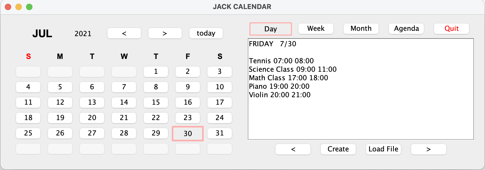

# Summer 2021 Project: Calendar

## Calendar

In the project, we designed and implemented a calendar similar to the Google calendar. A weekly view defaults on Google Calendar while a day view is default on ours.

## Functional Requirements

- Your design has to follow the MVC design pattern.
- The calendar that you can find from the bottom left of the example is called "current calendar". Each date should be clickable in the current calendar. When you click on a particular date, the current view will change accordingly. **The current calendar also comes with two buttons to navigate the current calendar back and forth by month. During this navigation, the selected view is not changing. Please be familiar with this behavior from Google Calendar.** The navigation can go as far as the Gregorian Calendar can go.

- The Today button moves the current view to the current day, week, or month depending on the currently selected view. See the google calendar for this function.
- **There is another set of two buttons right next to the Today button. (Find them in the picture below.) These buttons move the current view back and forth. (Only applicable to Day, Week, and Month views, not Agenda view. If the current view is Agenda view, these buttons will not change the current view.) See the google calendar for this function. The navigation can go as far as the Gregorian Calendar can make it.**

* Four buttons to select one of the views, Day, Week, Month, and Agenda. When the Agenda view is selected, the calendar asks the user to enter a period to display all events scheduled during this period. The time period for the Agenda view includes dates only without times for simplicity purposes.
* "CREATE" function through which the user can schedule a new event. The user can enter events in the past as well as in the future. For simplicity, assume events are scheduled based on hours. That is, you don't have to consider a minute and second in this project. If there is any time conflict, ask the user to enter the event again with the correct time.
* "From File" function through which the user can specify a file containing recurring events. Recurring events will be scheduled only through this option. The file can contain events for the future as well as those from the past. For simplicity, assume that the program's user will use this function only once right after the program starts. When your team submits the soft copy, include input.txt containing at least 10 different events that will be processed by this function. Note that input.txt will provide recurring events only.

  Each event in the input.txt takes up one line and consists of the following items separated by a semi-colon ;

  - event name: a name can have space
  - year: 4 digits
  - starting month: 1 ~ 12
  - ending month: 1 ~ 12
  - days: days will be a sequence of day abbreviations, SMTWHFA, without any space in it. Days can be any order. No space is allowed in days
  - starting time: use 24-hour system (0 ~ 23)
  - ending time: use 24-hour system (0 ~ 23)

   For example, the following line schedules Math Class on every M, W, F from January to February 2014. The class starts at 5:00 pm and ends at 6:00 pm on the scheduled date.
    _Math Class;2014;1;2;MWF;17;18;_  
  Again, assume events are scheduled based on hours.

- Add a simple additional feature to your calendar that facilitates the strategy pattern. (What I want to see is the use of the strategy pattern, not how fancy the function is.)
- The user should be able to use/test your calendar without any user manual. That is, the application should have a user-friendly interface.
